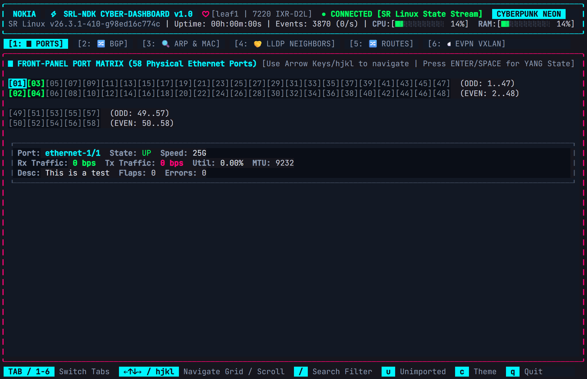
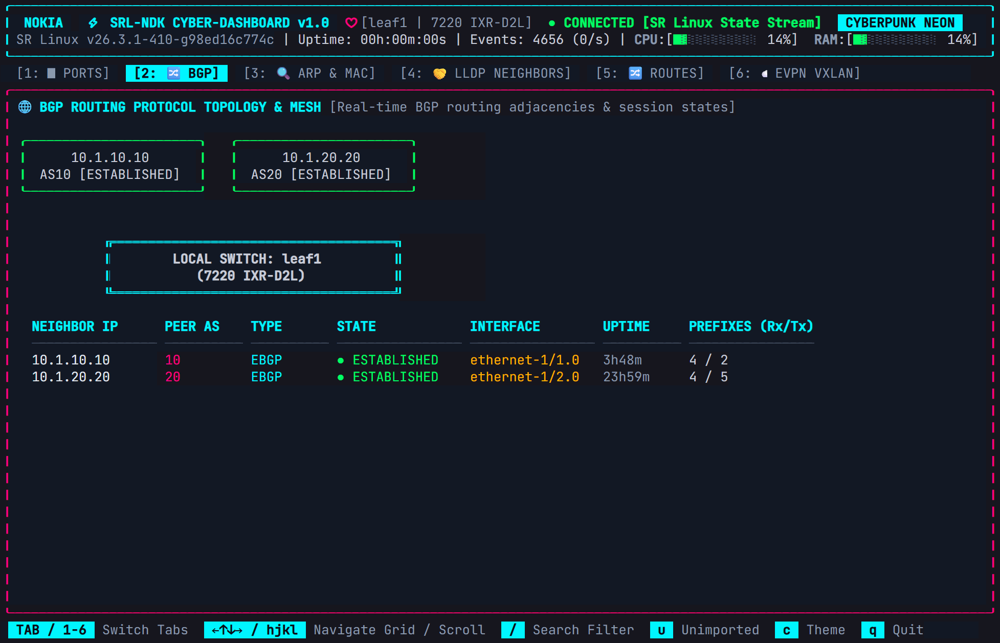
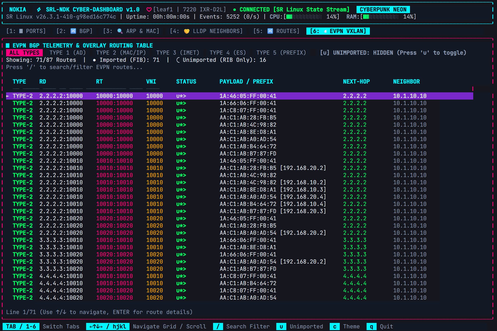
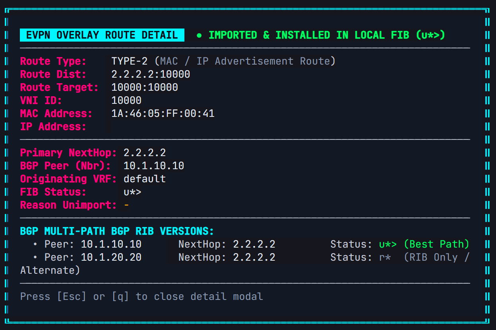

# srl-tui: Terminal UI Dashboard for Nokia SR Linux

`srl-tui` is a terminal UI application for monitoring **Nokia SR Linux** switches. Built using Go, the **NetOps Development Kit (NDK)**, **gNMI State Telemetry**, and Charm's **Bubble Tea** framework, it provides real-time visibility into switch hardware, interfaces, BGP peering, and EVPN routing state.

---

## Technical Features

- **Streaming Telemetry**: Subscribes directly to SR Linux gNMI notification streams (`/interface`, `/system`, `/network-instance`) and NDK telemetry events for sub-second updates without polling overhead.
- **Authoritative Telemetry Engine**: Obtains 100% of interface state, MAC tables, system metrics, and routing tables directly from gNMI and NDK state datastores (no host Linux OS scraping).
- **Single Native Binary**: Compiles into a single static Go binary (`~18.8MB`) that runs directly on SR Linux hardware or containerlab nodes (`leaf1`..`4`, `spine1`..`2`).
- **Interactive State Inspection**: Press `ENTER` or `SPACE` on any interface or route to inspect raw YANG/JSON state data.

---

## Application Views & Components

### 1. Header
- Displays system hostname, platform model, SR Linux OS version, and uptime.
- Shows gNMI / NDK stream connection status (`CONNECTED`).
- Displays CPU and memory utilization gauges alongside event counters.

### 2. Physical Port Matrix



- Displays front-panel ethernet interfaces dynamically matching switch hardware port counts (e.g. 58 physical ports on 7220 IXR-D2/D3 models).
- Color-coded operational states:
  - **Green**: Link Up / Healthy
  - **Gray**: Admin Down / Disconnected
  - **Red**: Error / Flapping
- Includes a split-pane inspector showing speed, MTU, traffic rates (bps/pps), errors, and descriptions.

### 3. Topology & BGP Mesh



- Renders an interactive ASCII fabric topology map connecting leaves and spines.
- Provides a live BGP neighbor table detailing peer state (`Established`, `Active`, `Down`), ASNs, session uptime, and prefix counts.

### 4. IP Routing Table
- Displays IPv4/IPv6 unicast routes with resolved BGP next-hops.
- Highlights Equal-Cost Multi-Path (ECMP) routes with multi-path badges (e.g. `10.1.10.10, 10.1.20.20 [ECMP x2]`).

### 5. EVPN Route View





- Displays EVPN Route Types 1 through 5:
  - Type 1 `(AD)` Auto-Discovery
  - Type 2 `(MAC/IP)` MAC/IP Advertisement
  - Type 3 `(IMET)` Inclusive Multicast Ethernet Tag
  - Type 4 `(ES)` Ethernet Segment
  - Type 5 `(IP-Prefix)` IP Prefix Route
- Indicates local FIB installation status: `u*>` (Imported & Installed) vs `r*` (Unimported / BGP-RIB only).
- Consolidates prefix paths while preserving backup path inspection in detail modals.
- Filters out self-originated routes to focus on received peer updates.

### 6. Live Search & Inspector Modal
- Live search filter (`/`) with automatic selection clamping.
- JSON/YANG state inspector modal (`ENTER` / `SPACE`) displaying raw datastore contents.

### 7. Color Themes
Includes 6 selectable color palettes (toggle with `c` or `t`):
1. `cyberpunk` (Cyan / Pink)
2. `synthwave` (Purple / Magenta)
3. `matrix` (Green / Dark)
4. `monokai` (Amber / Charcoal)
5. `cobalt2` (Blue / Yellow)
6. `solarized` (Solarized Dark)

---

## Keybindings Reference

| Key | Function |
|---|---|
| `Tab` / `Shift+Tab` | Cycle through navigation tabs (`Ports`, `Topology`, `ARP/MAC`, `LLDP`, `Routes`, `EVPN`) |
| `1` – `6` | Jump directly to specific tab index (1: Ports, 2: Topology, 3: ARP/MAC, 4: LLDP, 5: Routes, 6: EVPN) |
| `h, j, k, l` / `← ↑ ↓ →` | Move cursor selection in grid and table views |
| `ENTER` / `SPACE` | Open raw JSON/YANG state inspector modal for selected item |
| `/` | Focus live search filter |
| `u` | Toggle visibility of unimported EVPN routes (`r*`) |
| `c` / `t` | Cycle color theme |
| `?` | Toggle keybindings help overlay |
| `q` / `Ctrl+C` | Exit application |

---

## Building and Cross-Compilation

### Build Single Binary
```bash
# Build native binary
make build
# Or directly with Go:
CGO_ENABLED=0 go build -o srl-tui .
```

### Multi-Architecture Linux Builds (`linux/amd64` & `linux/arm64`)
Because `srl-tui` executes directly inside Linux SR Linux containers (or hardware switch OS instances), target binaries must be compiled for the Linux OS:

```bash
# Build both Linux architectures (AMD64 & ARM64)
make build-all

# Or build individual Linux architectures directly:
make build-linux-arm64    # Linux ARM64 (Apple Silicon Containerlab VMs / ARM switches)
make build-linux-amd64    # Linux AMD64 / x86_64
```

### Deploying to Containerlab / Switch Nodes
```bash
# For Containerlab on Apple Silicon Macs (ARM64 Linux VM):
docker cp dist/srl-tui-linux-arm64 leaf1:/usr/local/bin/srl-tui

# For Containerlab on x86_64 / Intel Linux:
docker cp dist/srl-tui-linux-amd64 leaf1:/usr/local/bin/srl-tui

# Launch application interactively inside node
docker exec -it leaf1 srl-tui
```

---

## Directory Structure

```
srl-tui/
├── .agents/
│   └── rules/                    # Workspace agent guidelines
│       └── no_hostname_conditionals.md
├── cmd/                          # Diagnostic tools and standalone utilities
├── go.mod                        # Go module dependencies
├── main.go                       # Application entry point
├── pkg/
│   ├── ndk/                      # gNMI & NDK telemetry client and state engine
│   │   ├── client.go             # gNMI streaming client implementation
│   │   ├── simulator.go          # Telemetry simulator
│   │   └── state.go              # Telemetry state datastore
│   └── tui/                      # Bubble Tea UI components and views
│       ├── app.go                # Application main loop
│       ├── keys.go               # Keybinding definitions
│       ├── components/           # UI View renderers (Ports, Topology, Routes, EVPN, Inspector)
│       └── theme/                # Color palettes
```

---

## License

Licensed under the Apache License, Version 2.0.
